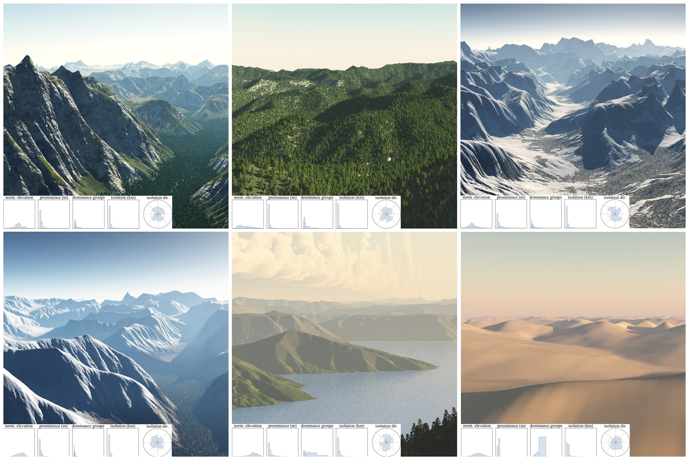

# Orometry-based Terrain Analysis and Synthesis

Given a terrain example, our method analyses different metrics related to its peaks and saddles graph (the Divide Tree), and then automatically synthesizes a heightfield conforming to these statistics.


## Repository contents

This repository contains our implementation of the paper, needed data, and examples on executing the code.

| Directory | Description |
| ---: | :--- |
| **[analysis](./analysis)**  | Python package with functions related to analysis of peak orometrics. |
| **[data](./data)**  | Peak data and statistics. *Check the README.md inside this directory for important setup instructions*. |
| **[img](./img)**  | Teaser image and other beautiful pictures of our synthetic terrains rendered using VUE. |
| **[input](./input)**  | Example user input maps as used for some of the figures in the article. |
| **[results](./results)**  | Some of our resulting terrains shown in the article, including their orometrics and divide trees. |
| **[synthesis](./synthesis)**  | Python package with functions related to Divide Tree synthesis and terrain generation. |
| **[utils](./utils)**  | Python package with auxiliary and common functions to either section. |

The directories/packages ``analysis``, ``synthesis`` contain the code regarding their respective parts of the article. Inside ``utils`` there are auxiliary and common functions to both parts.


## Running the code

We provide several *jupyter notebooks* that will serve as a guide on using the code.

**Analysis.ipynb**: given a set of input shapefiles for the desired regions, computes the list of peaks inside each region and computes the sampled disk statistics. You need to run this script before Classifier or Synthesis, since they rely on some of the outputs produced by it. 

**Classifier.ipynb**: the first part demonstrates how to compute the classification matrix for a set of terrains as shown in the article. The second part contains the utility to classify an arbitrary list of peaks (e.g. a synthetic terrain) into these region classes. It corresponds to sections 4.2 and 7.1 in the paper.

**Synthesis.ipynb**: divide tree synthesis demo, using a user input coarse elevation map and peak density map. Most of the code here is input, configuration and visualization. The parameters for the synthesis are passed in a dictionary, check the comments for details. This is section 5 in the article.

**TerrainFromDivtree.ipynb**: code to transform a divide tree into a TIN or DEM. Again, most of the code here is input or debug visualitzations, check the comments for info about the parameters of the reconstruction function. This is section 6 in the article.

**PlotHistograms.ipynb**: reads a peaks file CSV and computes the disk statistics for a given (latitude,longitude) pair, then plots the histograms as shown in the paper.

**PlotDivtrees.ipynb**: reads a png DEM files and their Divide Tree in txt format, then plots the peaks, saddles and edges of the tree on top of the DEM for visualization, as shown in the paper and supplementary material.


## Python environment

In order to run our code, you will need the following packages:
```
numpy, pandas, scipy, scikit-learn,   # numerical and data libraries
pyshp, shapely,                       # to process the region shapefiles and have geometric test functions
noise, pot, triangle,                 # additional utilities: noise, optimal transport and constrained Delaunay
pillow, scikit-image, opencv,         # image libraries (we could probably do everything with only scikit or opencv?)
matplotlib, jupyter                   # if you want to use the sample notebooks
```

We tested the provided code on a new Python 3.7 environment using Miniconda. All packages were installed using ``conda install`` except ``triangle``, which we had to install with ``pip``. 


## Remarks, improvements, and to-do

The code we provide here is a cleaned version of our research code and is provided *as is*. It would be nice to have a Divide Tree class encapsulating peaks, saddles and connectivity, as well as the reading/writing functions. Or to provide a library/package to compute the metrics.

Regarding the analysis of a DEM in order to extract its Divide Tree, which we do not include in the repository, we have directly edited the source code of [Andrew Kirmse's prominence program](https://github.com/akirmse/mountains) to read DEM of various dimensions and cell sizes instead of the SRTM definitions, as well as adding an export function of the divide tree as a TXT as used by our code. 

The erosion post-process on the terrain is not included either, since we used a C++ code that heavily depends on some internal libraries of our team. However, good aesthetic results can also be achieved with the erosion tools in other software (e.g. we experimented with Houdini). However, note that these implementations will not apply the compensating uplift that avoids eroding peaks, saddles and ridges to preserve the orometrics.


## Article

The article is published in [ACM Transactions on Graphics](), and can also be read [here](https://hal.archives-ouvertes.fr/hal-02326472/document).

Check also the supplementary material [here]().

If you use this code for your research, please cite our paper:
```
@article{Argudo2019orometry,
    title = {Orometry-based Terrain Analysis and Synthesis},
    author = {Argudo,Oscar and Galin,Eric and Peytavie,Adrien and Paris,Axel and Gain,James and Gu\'{e}rin,Eric},
    journal = {ACM Transactions on Graphics (SIGGRAPH Asia 2019)},
    year = {2019},
    volume = {38},
    number = {6}
}
```

## Acknowledgements

* Christian Hill for the [Poison Disc sampling code](https://scipython.com/blog/power-spectra-for-blue-and-uniform-noise/), which I copied into [utils.poisson](./utils/poisson.py).

* Andrew Kirmse for sharing his result datasets of world prominences and isolations, as well as the to compute these metrics. Check out [his repository](https://github.com/akirmse/mountains).